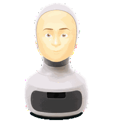
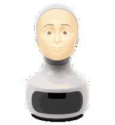
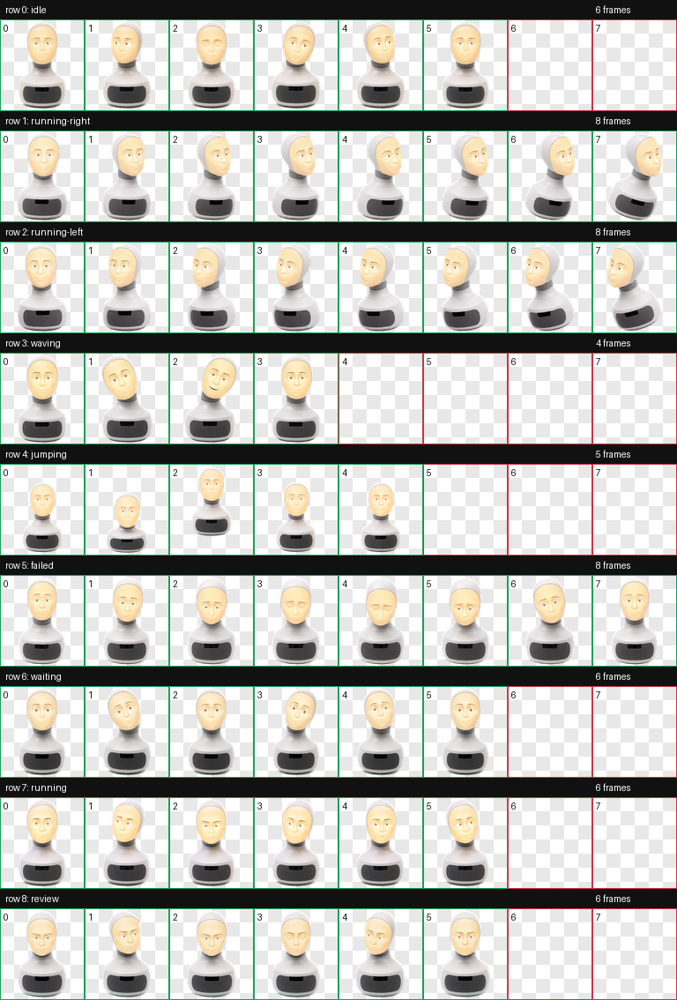

# Furhatling


Furhatling is a tiny animated desktop companion for agentic coding work. It is a Petdex pet inspired by warm social robots: a small white robot head, a softly projected face, a matte base, slow blinks, head tilts, and a curious desk-side mood.

It turns local Codex and Claude Code activity into ambient feedback: running, waiting, reviewing, failing, finishing, or asking for attention.

## Why I Made This

I use coding agents a lot, and they often spend time in the background running tools, waiting for permission, or switching between thinking and executing. Furhatling is an experiment in making that process feel more visible and more social.

Instead of repeatedly checking terminal output, the pet gives quiet feedback:

- a working animation when the agent is running tools
- a waiting pose when it needs input or approval
- a review pose when it is checking work
- a failed pose when something went wrong
- small status bubbles for action messages
- idle motion when nothing needs attention

It is not meant to replace logs or notifications. It is a small presence layer over the work.

## Demo States

| Idle | Running | Waiting | Review | Failed |
| --- | --- | --- | --- | --- |
|  |  |  |  |  |

Full contact sheet:



## Tech Stack

- Petdex Desktop for the floating macOS pet window
- Petdex CLI for install, startup, hooks, and diagnostics
- Codex and Claude Code hooks for agent status events
- Local Petdex sidecar on `127.0.0.1:7777`
- WebView/CSS sprite rendering
- A single animated `spritesheet.webp`
- A small `pet.json` manifest

Furhatling uses the Codex/Petdex pet atlas format: 8 columns by 9 rows. Each row represents one animation state.

## Files

```text
pet.json
spritesheet.webp
previews/
docs/contact-sheet.png
WEBSITE_COPY.md
LICENSE.md
```

Only these files are required at runtime:

```text
pet.json
spritesheet.webp
```

## Requirements

- macOS
- Node.js / `npx`
- Petdex
- Optional: Codex and/or Claude Code with Petdex hooks installed

Install Petdex:

```bash
npx petdex@latest init
```

Install or refresh hooks:

```bash
node "$HOME/.petdex/bin/petdex.js" hooks install
```

## Install Furhatling

Clone this repo or download the release zip.

From the repo folder:

```bash
mkdir -p "$HOME/.petdex/pets/furhatling" "$HOME/.codex/pets/furhatling"

cp pet.json spritesheet.webp "$HOME/.petdex/pets/furhatling/"
cp pet.json spritesheet.webp "$HOME/.codex/pets/furhatling/"
```

Why two locations:

- `~/.petdex/pets` is used by the floating Petdex Desktop pet.
- `~/.codex/pets` is used by Codex Desktop's custom pet picker.

## Use It

Wake Petdex:

```bash
node "$HOME/.petdex/bin/petdex.js" up
```

Switch to Furhatling:

```bash
open "petdex://furhatling"
```

You can also right-click the Petdex pet and select `furhatling` from the picker.

If you also want Codex Desktop's selected avatar to match, open:

```text
Codex Settings -> Appearance -> Pets
```

Then choose `Furhatling`.

## Swap Between Pets

Use the Petdex URL scheme:

```bash
open "petdex://furhatling"
open "petdex://boba"
open "petdex://grogu-kid"
```

List locally installed pet slugs:

```bash
find "$HOME/.petdex/pets" "$HOME/.codex/pets" -mindepth 1 -maxdepth 1 -type d -exec basename {} \; | sort -u
```

## Daily Commands

```bash
node "$HOME/.petdex/bin/petdex.js" up
node "$HOME/.petdex/bin/petdex.js" down
node "$HOME/.petdex/bin/petdex.js" toggle
node "$HOME/.petdex/bin/petdex.js" desktop status
node "$HOME/.petdex/bin/petdex.js" doctor
```

Inside Codex or Claude Code, if the `/petdex` slash command is installed:

```text
/petdex
/petdex up
/petdex down
/petdex status
/petdex doctor
```

## How It Works

Petdex installs hooks into supported agent configs. Those hooks run small local commands when agent events happen.

Typical flow:

1. You submit a prompt in Codex or Claude Code.
2. The agent starts thinking, running tools, or waiting.
3. The hook notifies the local Petdex sidecar.
4. Petdex writes or serves the current state.
5. The floating pet changes animation and may show a short status bubble.

This is why Furhatling can feel connected to the agent without being part of the agent itself. It is an ambient UI layer over local agent events.

## Animation States

- `idle`: calm blink / resting presence
- `running-right`: directional movement
- `running-left`: directional movement
- `waving`: greeting or finished work
- `jumping`: prompt submitted or attention moment
- `failed`: something went wrong
- `waiting`: waiting for approval or user input
- `running`: active work / tool execution
- `review`: focused review or checking state

## Troubleshooting

Check the install:

```bash
node "$HOME/.petdex/bin/petdex.js" doctor
```

If the pet does not appear:

```bash
node "$HOME/.petdex/bin/petdex.js" up
```

If Furhatling is not in the picker:

```bash
ls "$HOME/.petdex/pets/furhatling"
ls "$HOME/.codex/pets/furhatling"
```

Each folder should contain:

```text
pet.json
spritesheet.webp
```

If hooks do not work in Codex or Claude:

```bash
node "$HOME/.petdex/bin/petdex.js" hooks install
node "$HOME/.petdex/bin/petdex.js" doctor
```

## License And Credits

See [LICENSE.md](LICENSE.md).

Furhatling is a personal side project by Leo Gardberg. It is inspired by social robotics and was created with rights-cleared reference material. It is not intended to imply that Petdex, Codex, Claude Code, or Furhat Robotics endorse or maintain this project.
