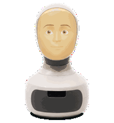
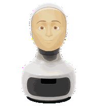
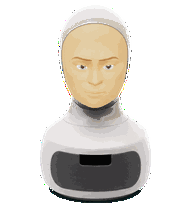
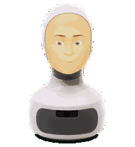
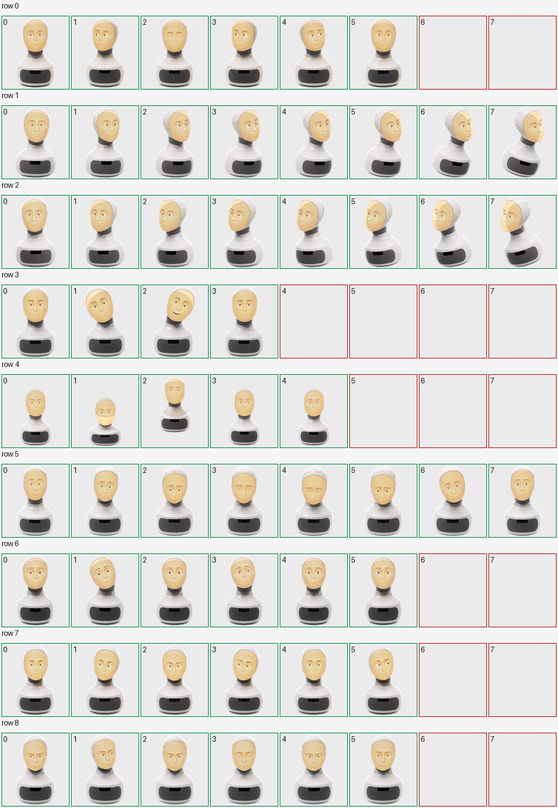

# Version History

This folder documents Furhatling visual experiments and release history. The root `pet.json` and `spritesheet.webp` remain the current installable pet unless a future release says otherwise.

## Current Alpha: v0.1.0

The current public alpha uses the original Furhatling projection and animation sheet.

| Idle | Waiting | Review | Running |
| --- | --- | --- | --- |
|  |  |  |  |

Full contact sheet:

## Experiment: Warm Projection

Warm Projection was an exploratory pass that tried to make the projected face slightly warmer and lower in brightness while reducing a few of the snappiest head-pose transitions.

It is kept here as design history, not as the default installable package. In practice, the difference was too subtle at pet size, so the stronger next direction is a more deliberate redraw: larger facial features, clearer contrast, and smoother in-between poses.

| Idle | Waiting | Review | Running |
| --- | --- | --- | --- |
|  |  |  |  |

Full contact sheet:

## Next Visual Direction

- Increase eye and mouth readability at `192 x 208`.
- Make the projected face area visibly lower-value, not just subtly warmer.
- Reduce abrupt head-angle jumps by creating smoother in-between frames.
- Keep the white shell, matte-grey neck, and tabletop robot silhouette consistent across every state.
